<div align="center">



<br/><br/>

[](https://github.com/Rishu123-png/friday-os/actions/workflows/ci.yml)
[](LICENSE)
[](#-platforms)
[](#-quickstart)
[](#-design-principles)
[](#-architecture)
[](CONTRIBUTING.md)

<br/>

[Design Principles](#-design-principles) · [Features](#-features) · [Architecture](#-architecture) · [Quickstart](#-quickstart) · [The Action Protocol](#-the-action-protocol) · [Security](#-security-model) · [Testing](#-testing)

</div>

---

## 🤔 What is FRIDAY OS?

FRIDAY OS is a **personal AI assistant that owns your device and your data**.

Most assistants are a text box that talks. FRIDAY OS is a full stack — a sci-fi HUD frontend, a native Android layer with real system privileges, and a self-hostable backend — wired together so that *"turn my torch on"* actually turns the torch on, *"remind me at 6"* actually schedules the alarm, and *"what do you remember about me"* answers from a memory store that lives on **your** machine.

It is **offline-first by design**. Every heavy capability — speech recognition, speech synthesis, wake word, embeddings, even a local LLM via llama.cpp — has an on-device path. Cloud providers are **optional accelerants**, not dependencies. Pull your network cable and it still works.

And because an assistant with system privileges is a serious thing, the whole device-control surface is a **typed, versioned, safety-tiered protocol** with confirmations, leases and honest status reporting — not a pile of shell commands glued to an LLM.

> **188 offline skills. 650 commits. 43,000+ lines of code. Built by one person, in public.**

---

## 🏗️ Architecture

<div align="center">

</div>

**Read it as a resilience ladder.** Each layer is independently useful, and every one degrades gracefully:

| Layer | If it's unavailable… |
|---|---|
| **Local engines** | Nothing breaks — this is the default path. Cloud is the fallback, not the other way round |
| **Backend** | The app runs fully on-device. The server is optional glue, never a dependency |
| **Cloud providers** | Fewer features, never a broken app. A missing key is a *reduced* app, not a dead one |
| **Native layer** | Web APIs take over; device actions degrade rather than fail |

### Repository layout

| Path | What's inside |
|---|---|
| **`www/`** | The entire frontend — `index.html`, 67 ES modules, HUD CSS, self-hosted fonts, service worker, manifest. **25,100+ lines.** |
| **`native/`** | 29 Java classes for the Android layer, plus `res/`, ProGuard rules, the vendored sherpa-onnx API and the build-time injection scripts. **14,600+ lines.** |
| **`backend/`** | FastAPI server — chat, STT, TTS, vision, embeddings, memory and the action queue. **3,000+ lines.** |
| **`protocol/`** | `action-v1.schema.json` — the single source of truth for the device protocol, kept in sync with the backend by a test. |
| **`tests/`** | 13 Node suites — HUD contracts, boot runtime, action protocol, proactive assistant, stress tests. |
| **`tools/`** | `buildenv.sh` (provisions android.jar + Capacitor stubs for offline `javac`), schema generator, Java compile checker. |
| **`codemagic.yaml`** | CI/CD — two workflows producing debug and signed-release APKs. |

### Why is `native/` Java files and not an `android/` project?

The Gradle project is **generated at build time**, not committed. The pipeline runs `npx cap add android`, then the Python scripts in `native/` patch the generated project:

- `register_plugin.py` — wires `FridayNative.java` into the Capacitor plugin registry
- `patch_manifest.py` — injects permissions, services and receivers into `AndroidManifest.xml`
- `add_llama_dep.py` / `add_sherpa_dep.py` — add the llama.cpp and sherpa-onnx dependencies
- `configure_release.py` — applies signing and release hardening
- `validate_android.py` — **fail-fast gate** that aborts the build if any injection didn't land

This keeps the repo small, the diff clean, and makes the native layer reproducible from source.

---

## ⚡ The Experience

What the HUD actually does, layer by layer.

### 🖥️ Cinematic boot
A real power-on sequence — not a fake splash screen. Eleven subsystems are checked individually and reported live: `core → bridge → memory → voice → wake word → vision → local AI → Groq → Blackbox → automation → HUD`. Each one resolves to **Ready**, **Pending**, **Disabled** or **Not installed**. Tap to skip.

### 🔵 The reactor
The centre of the HUD is a live telemetry orb. Its colour is the system's health, not decoration — cyan when nominal, **red when something is genuinely wrong**. Surrounding cards read location, weather, network and Bluetooth from the device.

### 🤝 Honest failure
This is the part most assistants get wrong.

When voice breaks, FRIDAY OS does **not** show a spinner forever. The reactor turns red, the orb status reads `Fault`, the header reports `SYSTEM DEGRADED — VOICE`, and the status bar says exactly which subsystem failed. A separate line lists every component — `VOICE ⚠ PENDING`, `LOCAL AI ⚠ NOT INSTALLED`, `GROQ ⚠ DISABLED · not configured` — so you always know what's working and what isn't.

**An assistant that lies about its own state is worse than one that admits it's broken.**

### 🎙️ Voice Engine 2.0
A formal state machine: `OFFLINE → READY → LISTENING → UNDERSTANDING → THINKING → EXECUTING → SPEAKING`. The orb, the feed and the status line all follow real state — **no fake animation**.

Adjustable barge-in sensitivity, custom wake words, streaming voice that speaks while it thinks, and hands-free auto-mic conversation.

### 🧠 Memory that persists
Facts, notes and semantic recall in a local SQLite store, plus daily conversation digests generated on-device. A compact memory brief is injected into every prompt, so it knows you across sessions. Pinned memories are never auto-deleted. One endpoint wipes everything.

### 📱 Real device control
15 typed actions across three safety tiers — torch, volume, brightness, WiFi, Bluetooth, media, app launch, alarms, battery, storage, notifications, screen reading, screenshots, calls and SMS.

### 🛠️ And the rest

| | |
|---|---|
| **Call Assistant** | Accept · Decline · Silence · Decline-with-message, previewing the exact recipient and text before anything sends. Honestly scoped: it **cannot** intercept cellular audio or inject an AI voice into a call. |
| **FRIDAY Inbox** | Reads your notifications and **drafts** replies from your own memory. Sends only after you say so. Smart categories, mute lists, rate limits. |
| **Security & Privacy** | App lock (PIN, never plaintext), cloud-AI consent gate, local audit trail, Keystore-encrypted keys |
| **Emergency SOS** | Say "SOS" and it SMSes your live location after an 8-second cancel window |
| **Automation** | Event-driven rules — battery guard, headphone resume, offline comfort. Risky actions still confirm |
| **Agent orchestrator** | Multi-step decomposition with a verification pass |
| **Airrouter** | Provider routing and failover across local + cloud models |
| **Performance** | FPS / CPU / RAM / AI-latency monitor, battery gate, response cache |
| **Bridges** | Optional **Telegram** and **MQTT** — reach your assistant anywhere, or wire it into your smart home |

---

## 🧭 Design Principles

These are the rules the codebase actually follows. They explain most of the architectural decisions you'll see.

| Principle | What it means in practice |
|---|---|
| **🛜 Offline-first, not offline-only** | Local engines are the default path. Cloud is opt-in and degrades gracefully. A missing API key means *fewer features*, never a broken app. |
| **🔐 Fail-closed security** | A missing server token raises `503` — it never silently becomes an open API. Unsafe production config refuses to boot. Deny is the default state. |
| **🧠 The device is the frontier** | The backend is stateless glue. Real capability lives in the native layer, where the permissions and the sensors are. |
| **✍️ Typed actions, never free-form commands** | The LLM can pick *which* of 15 vetted actions to run. It cannot invent a 16th, cannot guess a phone number, cannot skip a confirmation. |
| **🤝 Honest status** | The UI never claims an action succeeded because it was *queued*. States are `queued → claimed → verified / failed / denied / unsupported`, and "unverified" is a real, displayed outcome. |
| **🔒 Your data stays yours** | No telemetry. No analytics. No phone-home. Memory lives in a SQLite file you own and can wipe with one endpoint. |
| **📦 Self-hostable, no lock-in** | One `docker run` and you have your own backend. Bring your own keys, your own model, your own server. |

---

## 🚀 Quickstart

### Prerequisites
- **Node 20+** and **Python 3.12+** for the web app and backend
- **JDK 21 + Android SDK 35** only if you're building the APK

### 1 · Run the HUD

```bash
git clone https://github.com/Rishu123-png/friday-os.git
cd friday-os
npm run serve          # → http://localhost:8080
```

That's it. The HUD boots fully offline with 188 local skills. No keys, no backend, no account.

### 2 · Run the backend (optional — unlocks cloud models & sync)

```bash
cd backend
pip install -r requirements.txt

cp ../.env.example .env
python3 -c "import secrets; print(secrets.token_hex(32))"   # → paste into FRIDAY_TOKEN

uvicorn main:app --host 0.0.0.0 --port 8000
```

Interactive API docs at **`http://localhost:8000/docs`**, live action dashboard at **`/dashboard`**.

Or with Docker:

```bash
docker build -f backend/Dockerfile -t friday-backend .
docker run -d -p 8000:8000 --env-file backend/.env friday-backend
```

### 3 · Build the Android app

```bash
npm ci
npx cap add android
npx cap sync android
cd android && ./gradlew assembleDebug     # → android/app/build/outputs/apk/debug/
```

Or push to `main` — **Codemagic builds a debug APK automatically.**

### Optional heavy engines

The light core boots with five dependencies. Add these to `requirements.txt` when you want more:

| Package | Unlocks | Weight |
|---|---|---|
| `edge-tts` | Neural TTS voices | light, needs net |
| `faster-whisper` | Server-side STT | ~2 GB |
| `sentence-transformers` | Server-side embeddings | ~500 MB |
| `paho-mqtt` | Smart-home bridge | light |

---

## 🔌 The Action Protocol

This is the most interesting part of the codebase, and the reason an LLM is allowed anywhere near your device.

**`protocol/action-v1.schema.json`** defines exactly **15 device actions**. Each one declares typed arguments, a safety tier, and whether it requires confirmation. A test asserts the schema and the backend's `ACTION_DEFINITIONS` never drift apart.

### The three safety tiers

| Tier | Actions | Behaviour |
|---|---|---|
| 🟢 **Low** | `torch`, `volume`, `brightness`, `wifi`, `bluetooth`, `media`, `apps`, `alarms`, `battery`, `storage` | Executes immediately |
| 🟡 **Medium** | `notifications`, `screen_read`, `screenshot` | Requires explicit confirmation — these expose your data |
| 🔴 **High** | `phone`, `sms` | Requires confirmation **and** an exact, validated phone number |

### How a request flows

```
  "call Mom"
      │
      ▼
  ┌──────────────────────────────┐
  │ LLM proposes an action       │   ← it may only choose from the 15
  │ {type: "phone",              │
  │  args: {number: "..."}}      │
  └──────────────┬───────────────┘
                 ▼
  ┌──────────────────────────────┐
  │ Validation                   │   ← typed args, ranges, enums, E.164
  │                              │     a missing number is NEVER guessed
  └──────────────┬───────────────┘
                 ▼
  ┌──────────────────────────────┐
  │ Enqueue (201)                │   ← idempotent: same request id
  │ → state: queued              │     returns the same action id
  └──────────────┬───────────────┘
                 ▼
  ┌──────────────────────────────┐
  │ Confirmation (high tier)     │   ← a bare "yes" is NOT acceptable;
  │                              │     the exact pending action id is
  └──────────────┬───────────────┘     required, and bound to the owner
                 ▼
  ┌──────────────────────────────┐
  │ Device claims + executes     │   ← bounded lease (default 90 s),
  │ → verified / failed /        │     lease retries are strictly limited
  │   denied / unsupported       │
  └──────────────────────────────┘
```

### Guarantees the tests enforce

- **No invented actions** — exactly 15 are covered; the LLM's tool list is normalised against them.
- **No guessed dangerous details** — a missing phone number or SMS body fails loudly rather than being improvised.
- **No confirmation by accident** — "yes" alone cannot confirm; the exact pending id must be supplied, and it is bound to the owning user.
- **No false success** — a queued action never reports as completed, and unavailable verification reports `unverified`, not `done`.
- **No revival of expired actions** — and cancellation of an already-claimed action is never falsely guaranteed.
- **Idempotent everywhere** — retries reuse the id and reject conflicting payloads; an aborted chat is never silently retried.

### API surface

| Method | Endpoint | Purpose |
|---|---|---|
| `GET` | `/health` | Liveness + provider status |
| `GET` | `/v1/actions/capabilities` | What this device can do |
| `POST` | `/v1/actions` | Enqueue an action |
| `POST` | `/v1/actions/claim` | Device claims work (rate-limited, 10/min) |
| `GET` | `/v1/actions/{id}` | Poll state |
| `POST` | `/v1/actions/{id}/confirm` | Confirm |
| `POST` | `/v1/actions/{id}/cancel` | Cancel |
| `POST` | `/v1/actions/{id}/result` | Report verified outcome |
| `POST` | `/v1/chat` | Conversational turn with tool loop |
| `POST` | `/v1/stt` · `/v1/tts` | Speech in / speech out |
| `POST` | `/v1/vision` · `/v1/web` · `/v1/embed` | Vision, fetching, embeddings |
| `GET/POST/DELETE` | `/v1/memory[/fact\|/note]` | Memory management |
| `GET` | `/dashboard` | Live operations view |

Every route requires `Authorization: Bearer <FRIDAY_TOKEN>`.

---

## 🔐 Security Model

An assistant that can read your screen and send SMS deserves scrutiny. Here's how it's contained.

**Authentication is mandatory and fail-closed.**
```python
if not expected:
    if settings.FRIDAY_ALLOW_INSECURE_LOCAL:
        return                      # explicit, opt-in, development only
    raise HTTPException(503, "Server authentication is not configured")
```
No token configured means **the server refuses to serve** — it does not fall back to open access. Comparison uses `hmac.compare_digest`, so there's no timing oracle.

**Identity is server-derived, never client-supplied.**
Your database key is `sha256(identity)[:32]`. The `X-User-ID` header is **rejected by default** and only honoured when a trusted multi-user deployment sets `ALLOW_USER_HEADER=true`.

**Keys live in Android Keystore.** Groq keys entered on-device are encrypted with Keystore, never shown again, never included in data exports, and never prefilled in the source or APK.

**Diagnostics redact themselves.** `FridayDiagnostics.java` scrubs anything matching `gsk_…` / `sk-…` before an export, so support bundles are safe to share.

**Startup refuses unsafe config.** `settings.validate_startup()` runs before the server accepts a single request.

**CORS is allowlisted** — `http://localhost,capacitor://localhost` by default, not `*`.

> 🔎 **Found a vulnerability?** Please open a [private security advisory](https://github.com/Rishu123-png/friday-os/security/advisories/new) rather than a public issue. See [SECURITY.md](SECURITY.md).

---

## 🧪 Testing

```bash
npm test             # everything
npm run test:web     # Node test suites
npm run test:backend # Python test suites
```

The suite is not decorative — it's the enforcement mechanism for the guarantees above. It covers the action protocol end-to-end, confirmation binding, lease expiry, idempotency, boot runtime, HUD contracts, provider failover, proactive behaviour, offline asset integrity and a stress pass.

There's also `tools/javac-check.sh`, which compile-checks all 29 native classes against `android.jar` plus Capacitor stubs — **no Android Studio required**. Run `tools/buildenv.sh` once to provision the jar and stubs.

---

## 📁 Configuration

All backend config lives in `backend/.env` (gitignored). Copy `.env.example` to start.

| Variable | Default | Notes |
|---|---|---|
| `FRIDAY_TOKEN` | — | **Required.** `openssl rand -hex 32` |
| `FRIDAY_ALLOW_INSECURE_LOCAL` | `false` | Dev-only escape hatch |
| `GROQ_API_KEY` | — | Optional. Primary cloud brain |
| `GROQ_MODEL` | `llama-3.3-70b-versatile` | |
| `GROQ_VISION_MODEL` | `meta-llama/llama-4-scout-17b-16e-instruct` | |
| `BLACKBOX_ENABLED` | `false` | Off unless you attest free access |
| `DB_PATH` | `./friday.db` | Memory store |
| `ACTION_DB_PATH` | `./action_queue.db` | Action queue |
| `ACTION_CLAIM_LEASE_SECONDS` | `90` | Lease window |
| `MAX_AUDIO_BYTES` | `25000000` | Upload cap |
| `STT_MODEL` | `small` | Whisper size |
| `TTS_VOICE` | `en-IN-NeerjaNeural` | |
| `EMBED_MODEL` | `sentence-transformers/all-MiniLM-L6-v2` | |
| `CORS_ORIGINS` | `http://localhost,capacitor://localhost` | Comma-separated |
| `ALLOW_USER_HEADER` | `false` | Multi-user only |
| `TELEGRAM_BOT_TOKEN` | — | Optional bridge |
| `MQTT_HOST` / `_PORT` / `_USER` / `_PASS` | — | Optional smart-home bridge |

> ⚠️ **Never commit `backend/.env`.** It is gitignored — keep it that way. If a key ever touches a commit, rotate it immediately; deleting the file does **not** remove it from history.

---

## 📱 Platforms

| Platform | Status |
|---|---|
| **Android** | Primary target — full native layer via Capacitor 7 |
| **PWA / Browser** | Full HUD; device actions degrade to web APIs |
| **Desktop** | The HUD runs in any browser via `npm run serve` |
| **iOS** | Not yet — the native layer is Android-specific |

---

## 🗺️ Roadmap

- [ ] Finish splitting the 7,244-line `app.js` monolith into the `modules/` controllers
- [ ] Wire the 4 abandoned `modules/` controllers into the boot path (or delete them)
- [ ] Onboarding flow for first-run key setup
- [ ] iOS exploration via a Capacitor Swift shim
- [ ] Plugin registry SDK for third-party actions
- [ ] Expand the action protocol beyond 15

---

## 🤝 Contributing

Contributions are genuinely welcome — this is a large, ambitious codebase and there's plenty of room.

```bash
git clone https://github.com/Rishu123-png/friday-os.git
cd friday-os && npm ci
npm test              # must stay green
```

**Before you open a PR:**
1. `npm test` passes.
2. Anything touching the device protocol updates `protocol/action-v1.schema.json` **and** `backend/action_protocol.py` (a test will catch you if you forget).
3. **No new secrets.** Not in code, not in comments, not in tests, not in commit messages, and not "temporarily".
4. New user-facing strings respect the existing i18n module.

See [CONTRIBUTING.md](CONTRIBUTING.md) for the full guide and [CODE_OF_CONDUCT.md](CODE_OF_CONDUCT.md) for community expectations.

**Great first issues:** the `modules/` split, i18n coverage, and new action-protocol tests.

---

## 📜 License

[MIT](LICENSE) — use it, fork it, ship it.

---

<div align="center">

### ⭐ If FRIDAY OS is interesting to you, a star genuinely helps. It's a one-person project.

**Built offline-first. Built private-first. Built to actually work.**

<sub>Named after FRIDAY — *Female Replacement Intelligent Digital Assistant Youth*.</sub>

</div>